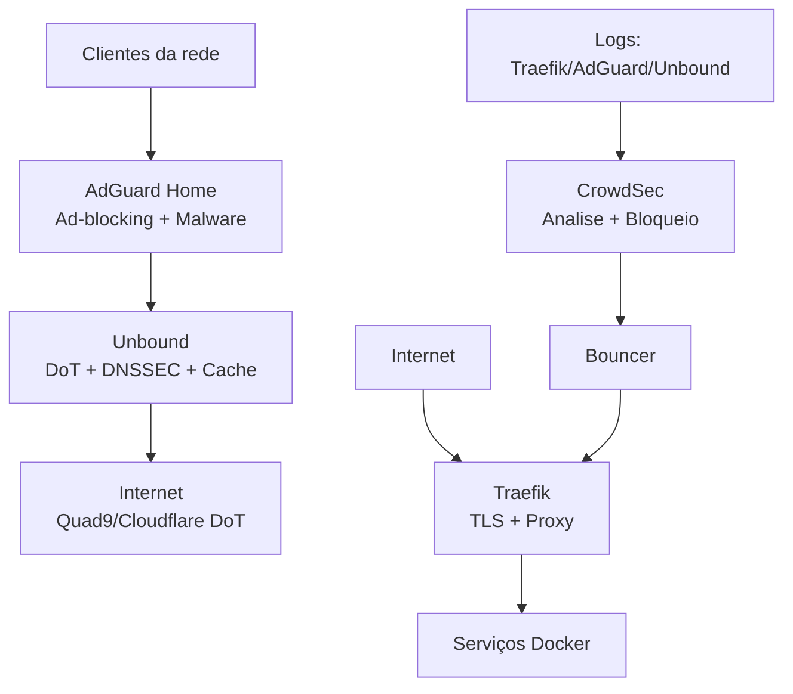

# Homelab Stack

Stack de homelab com DNS local protegido, bloqueio de anúncios/malware, DNS recursivo com privacidade (DoT) e proteção contra abusos.

## Serviços

| Serviço | Função |
|---|---|
| **Traefik** | Reverse proxy + TLS automático via Cloudflare |
| **AdGuard Home** | DNS local + bloqueio de anúncios e malware |
| **Unbound** | DNS recursivo + cache + DNSSEC + DoT |
| **CrowdSec** | Proteção contra brute force, abuso e análise de logs DNS |

## Arquitetura



## Pré-requisitos

- Docker e Docker Compose instalados
- Domínio configurado na Cloudflare
- Portas `53/TCP+UDP`, `80/TCP` e `443/TCP` liberadas no roteador

```bash
docker --version
docker compose version
```

---

## Instalação Rápida (Automatizada)

```bash
# Clone ou extraia o projeto
cd ~/homelab

# Execute o script de setup (irá guiar toda a configuração)
bash setup.sh

# Ou use o Makefile
make setup
make up
```

### ⚠️ Se houver erro de permissão no AdGuard:

```bash
# Use o script de correção
chmod +x fix-permissions.sh
./fix-permissions.sh
make up
```

### ℹ️ Healthchecks Configurados

Todos os containers possuem healthchecks para monitoramento automático:
- **Traefik**: Verifica se a porta 8080 está respondendo
- **Unbound**: Testa resolução DNS com `drill google.com`
- **AdGuard**: Verifica se a interface web (porta 3000) está acessível
- **CrowdSec**: Verifica se o `cscli` está funcionando
- **CrowdSec Bouncer**: Testa conectividade na porta 8080

Use `make health` ou `docker compose ps` para ver o status de saúde.

---

## Instalação Manual

### 1. Obter o projeto

```bash
unzip homelab-stack.zip && cd homelab-stack
```

Ou mover para `/srv/homelab`:

```bash
sudo mkdir -p /srv/homelab
sudo mv * /srv/homelab/
cd /srv/homelab
```

### 2. Criar token da Cloudflare

No painel: **My Profile → API Tokens → Create Token → Custom Token**

Permissões necessárias:
- DNS → Edit
- Zone → Read

Zone Resources: Include → Specific Zone → seu domínio.

### 3. Configurar variáveis de ambiente

```bash
cp .env.example .env
```

Edite `.env`:

```env
CF_DNS_API_TOKEN=SEU_TOKEN_AQUI
```

### 4. Configurar domínio e senha do dashboard

Em `traefik/traefik.yml`, substitua o e-mail pelo seu.

Em `traefik/dynamic/dashboard.yml`, substitua `traefik.seudominio.com` pelo seu domínio.

Instale o `htpasswd` (se necessário):

```bash
# Arch Linux
sudo pacman -S apache

# Debian/Ubuntu
sudo apt install apache2-utils
```

Gere o hash de senha:

```bash
htpasswd -nb admin SUA_SENHA_FORTE
```

Cole o hash gerado em `traefik/dynamic/middlewares.yml`, substituindo `admin:$apr1$CHANGE_ME`.

### 5. Criar diretórios e arquivo ACME

```bash
mkdir -p traefik/acme crowdsec/data adguard/work adguard/conf
touch traefik/acme/acme.json
chmod 600 traefik/acme/acme.json
```

### 6. Subir o CrowdSec e gerar a API key do bouncer

```bash
docker compose up -d crowdsec
docker logs -f crowdsec
```

Após inicializar, gere a chave do bouncer:

```bash
docker exec crowdsec cscli bouncers add traefik-bouncer
```

Substitua `CROWDSEC_BOUNCER_API_KEY` no `docker-compose.yml` pela chave gerada.

### 7. Subir a stack completa

```bash
docker compose up -d
docker ps
```

Containers esperados: `traefik`, `crowdsec`, `crowdsec-bouncer`, `unbound`, `adguardhome`.

### 8. Configurar AdGuard Home

A configuração do AdGuard Home agora é **versionada** em `adguard/conf/AdGuardHome.yaml`.

Para primeiro acesso (se necessário): `http://IP_DO_SERVIDOR:3000`

**Listas de bloqueio já configuradas:**
- AdGuard DNS filter
- Malware Domain Blocklist (URLHaus)
- NoCoin Filter List
- Phishing Army Blocklist

Em **Settings → DNS Settings → Upstream DNS Servers**, o Unbound já deve estar configurado:

```
127.0.0.1:5335
```

**🔐 Esqueceu a senha?** Veja o guia de reset em [TROUBLESHOOTING.md](TROUBLESHOOTING.md#problema-esqueci-a-senha-do-adguard-home)

### 9. Configurar DNS no roteador

Defina o DNS primário dos dispositivos da rede como `IP_DO_SERVIDOR`.

### 10. Subir subdomínios na Cloudflare e verificar TLS

Crie registros A apontando para o seu IP público (ex: `traefik.meudominio.com.br`) e acompanhe:

```bash
docker logs -f traefik
```

Acesse o dashboard em `https://traefik.meudominio.com.br` com o login `admin`.

---

## Comandos Úteis (Makefile)

### Gerenciamento Básico
```bash
make setup      # Executar setup automatizado
make up         # Subir todos os serviços
make down       # Parar todos os serviços
make restart    # Reiniciar serviços
make status     # Status dos containers
```

### Monitoramento e Logs
```bash
make logs                    # Ver logs (todos)
make logs-svc svc=traefik    # Ver logs de serviço específico
make health                  # Verificar saúde dos serviços (resumo)
make test-health             # Health check detalhado com diagnósticos
```

### Manutenção
```bash
make pull       # Atualizar imagens
make backup     # Backup dos volumes
make clean      # Parar e remover containers/volumes (⚠️ CUIDADO!)
```

### CrowdSec
```bash
make crowdsec cmd='alerts list'      # Ver alertas
make crowdsec cmd='decisions list'   # Ver IPs banidos
make crowdsec cmd='bouncers list'    # Ver bouncers ativos
make crowdsec cmd='metrics'          # Métricas
```

### 🔄 Refazer Stack Completa

Se algo der errado e você quiser recomeçar do zero:

```bash
# 1. Fazer backup (opcional mas recomendado)
make backup

# 2. Parar e remover tudo
make clean

# 3. Reconfigurar (vai gerar nova API key do CrowdSec)
make setup

# 4. Subir novamente
make up

# 5. Verificar saúde
make test-health
```

Ou com Docker Compose diretamente:

```bash
docker compose restart                   # reiniciar
docker compose down                      # parar
docker compose pull && docker compose up -d  # atualizar
docker compose logs -f                   # logs gerais
docker logs -f traefik                   # logs por serviço
```

---

## Melhorias Implementadas

### 🔒 Privacidade DNS (DoT)
O Unbound agora usa **DNS over TLS** para consultas upstream:
- Quad9: `9.9.9.9` e `149.112.112.112`
- Cloudflare: `1.1.1.1` e `1.0.0.1`

### 🛡️ Proteção Avançada
- **AdGuard**: Bloqueio de malware, phishing e cryptominers
- **CrowdSec**: Agora analisa logs do AdGuard e Unbound
- **Healthchecks**: Monitoramento automático de saúde dos containers
- **Resource limits**: Limites de CPU/memória para todos os containers

### ⚙️ Automação
- **setup.sh**: Script interativo de configuração inicial
- **Makefile**: Comandos simplificados para gerenciar o ambiente
- **AdGuardHome.yaml**: Configuração versionada (sem setup manual)

---

## Documentação

| Documento | Conteúdo |
|---|---|
| [TROUBLESHOOTING.md](TROUBLESHOOTING.md) | Soluções para problemas comuns (containers unhealthy, erros, etc.) |
| [CHANGELOG.md](CHANGELOG.md) | Histórico de mudanças e melhorias implementadas |
| [docs/SECURITY.md](docs/SECURITY.md) | Guia de segurança, senhas, autenticação e reset de credenciais |
| [docs/DNS_REWRITES_EXAMPLES.md](docs/DNS_REWRITES_EXAMPLES.md) | Exemplos de DNS Rewrites para acessar serviços por nome |
| [docs/configure.md](docs/configure.md) | Configuração detalhada de cada ferramenta da stack |
